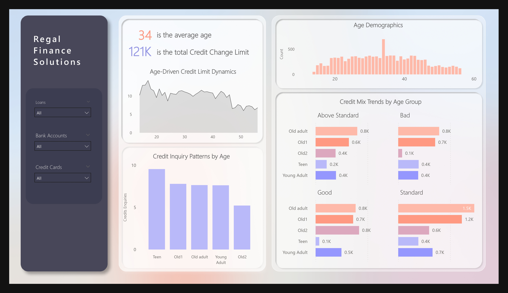
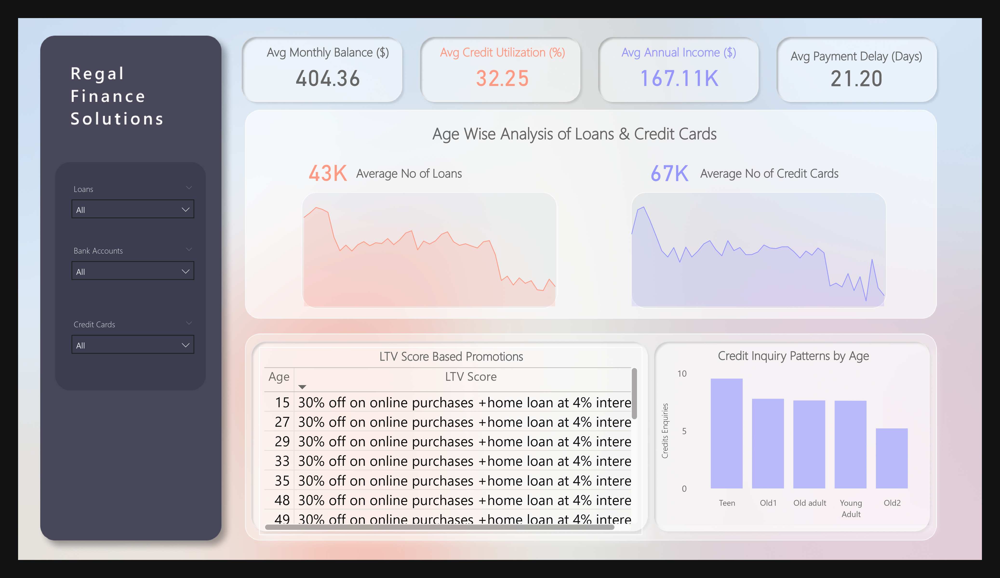
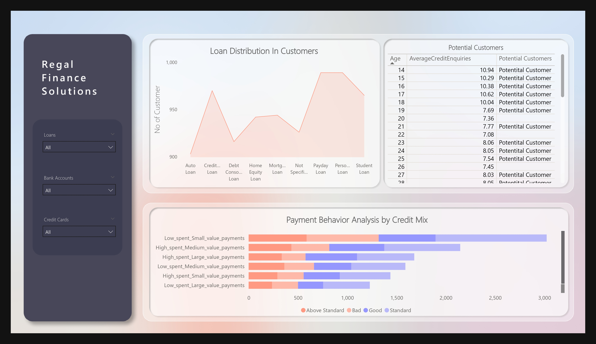
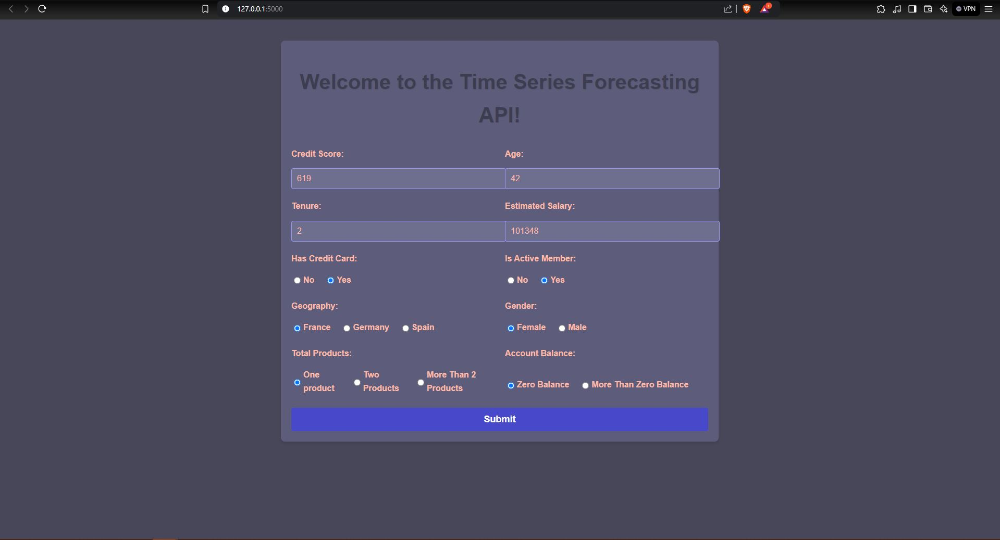
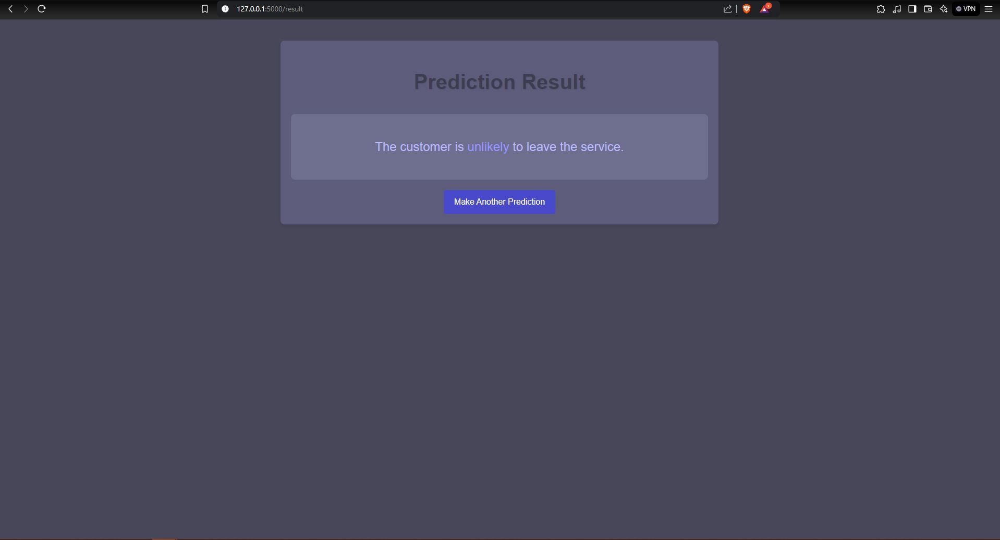

# Regal Finance Solutions: End-to-End Financial Data Automation  

This repository contains a comprehensive project that automates the financial data workflow for Regal Finance Solutions. It demonstrates the integration of multiple technologies to streamline data collection, processing, analysis, and deployment, ensuring accuracy, efficiency, and scalability. This repository addresses complex, real-world business scenarios by implementing advanced solutions leveraging DAX for data modeling, M Language for ETL transformations, and machine learning for predictive analytics and automation.
 
---

### **Featured Case Study**  
Read the detailed case study on Regal Finance Solutions :  [End-to-End Automation : Transforming Financial Data Analysis with Cloud and AI](https://medium.com/@ayush.developer10/nextera-supplies-analytical-case-study-a07776b25ced)  

---

## **Dashboards**  

### **Dashboard Previews**  

#### Dashboard Visual 1:  
   

#### Dashboard Visual 2:  
   

#### Dashboard Visual 3:  
 


---

## **Time Series Forecasting API**  

### **Application Screenshot**  

#### Input the Data
  

#### Output Results
 


---

# Real-World Business Challenges Tackled in This Repository

This repository addresses key business challenges and provides insights based on real-world data. Below are the primary questions explored and analyzed in this project:

## Key Business Questions

1. **Key Metrics Overview**
   - What are the averages for annual income, monthly balance, payment delays, and credit utilization?

2. **Payment Behavior Analysis**
   - How does payment behavior vary across credit mix categories?

3. **Customer Age Distribution**
   - What is the age distribution of customers?

4. **Credit Scores by Age Group**
   - How are credit scores distributed among these age groups?

5. **Payment Behaviors by Credit Mix**
   - What is the frequency of payment behaviors across credit mix categories?

6. **Loan Approach Targeting**
   - Which age groups are ideal for loan approaches?

7. **In-Depth Age Group Analysis**
   - Which age groups have an average inquiry count > 7.5?

8. **LTV Score Calculation and Promotions**
   - How are LTV scores calculated?

9. **Loans and Credit Cards by Age**
   - What are the average loans and credit cards held by each age group?

10. **Loan Disbursement by Type**
    - What is the distribution of loan types disbursed?

---

## **Key Features**  

1. **Outlook Email Automation**: Automated retrieval of financial data files via Microsoft Workflow, ensuring timely and error-free downloads.
2. **Google Drive**: Automated workflow stores Excel sheets in Google Drive, ensuring organized and secure data storage. 
3. **Google Cloud Platform (GCP) Integration**: Leveraged Google Cloud Platform (GCP) API to seamlessly connect Google Drive with Power BI for efficient data import and analysis.    
4. **Python Data Transformation**: Preprocessing, cleaning, and merging datasets to create consolidated inputs for analysis.  
5. **Power BI Dashboard**: Advanced DAX-based transformations and interactive visualizations for actionable insights.  
6. **Machine Learning Model Deployment**: Training and deploying ML models using Flask to predict trends and provide forecasts.  
7. **Containerization with Docker**: Fully Dockerized application for seamless deployment and cross-environment compatibility.  

---

## **Workflow Overview**  

1. **Data Ingestion**: Automated email handling via Microsoft Workflow; files are saved directly to Google Drive.  
2. **Data Transformation**: Python scripts perform cleaning, merging, and formatting of the datasets.  
3. **Dashboarding**: Power BI consumes the processed data to create interactive dashboards with advanced metrics.  
4. **Model Training & Deployment**: Flask serves machine learning predictions in a web-friendly interface.  
5. **Containerization**: Docker ensures smooth application deployment across different environments.  

---

## **Technologies Used**  

- **Microsoft Workflow**: Automates Outlook email operations.  
- **Google Cloud Platform (GCP)**: For data storage, processing, and API integration.  
- **Google Drive**: Secure storage for Excel files, automated through workflows.  
- **Python**: Data preprocessing, cleaning, and backend integration.  
- **Power BI**: Visual analytics and dashboard creation.  
- **Figma**: Designed visually appealing and intuitive dashboard prototypes.  
- **Flask**: Web framework for ML model deployment.  
- **Docker**: Containerization for scalable deployment.  
  

---

## **Project Architecture**  

1. Automated data retrieval from Outlook.  
2. Data stored and processed on GCP.  
3. Cleaned data fed into Power BI for analysis and dashboarding.  
4. Machine learning models trained and deployed via Flask API.  
5. Dockerized application for deployment.  

---

## **Getting Started**  

### **Prerequisites**  
- Docker installed locally.  
- Access to Google Cloud Platform.  
- Power BI Desktop for dashboard visualization.  

### **Setup**  
1. Clone this repository:  
   ```bash  
   git clone [https://github.com/AyushAI/RegalCloud-AI-Solutions-Financial-Workflow-Automation-from-Outlook-to-Dockerized-ML.git]
